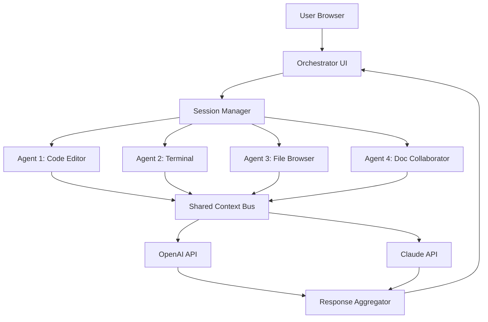

# Pi-Hive: Decentralized Multi-Agent Collaboration Dashboard for AI Workflows

[](https://betoolm12.github.io/pi-web-station/)

**Pi-Hive** reimagines the way developers interact with AI coding agents by transforming the traditional single-chat interface into a collaborative, multi-agent ecosystem. Inspired by the real-time responsiveness of Pi Dashboard, Pi-Hive extends the concept into a distributed command center where multiple AI agents work in parallel, share context, and produce results through a unified visual interface. Think of it as a mission control room for your AI workforce—each agent is a specialist, and you are the orchestrator.

---

## Table of Contents

1. [The Core Philosophy](#the-core-philosophy)
2. [Architecture Overview](#architecture-overview)
3. [Key Features](#key-features)
4. [SEO-Optimized Keyword Integration](#seo-optimized-keyword-integration)
5. [Multi-Model AI Integration (OpenAI & Claude)](#multi-model-ai-integration-openai--claude)
6. [Example Profile Configuration](#example-profile-configuration)
7. [Example Console Invocation](#example-console-invocation)
8. [Emoji OS Compatibility Table](#emoji-os-compatibility-table)
9. [Responsive UI & Multilingual Support](#responsive-ui--multilingual-support)
10. [24/7 Customer Support & Disclaimer](#247-customer-support--disclaimer)
11. [License](#license)

---

## The Core Philosophy

In the year 2026, the standard for AI tooling has shifted from single-threaded conversations to orchestrated agent swarms. Pi-Hive was built on the premise that **collaboration should be visual, persistent, and decoupled**. Where Pi Dashboard excels at managing a single chat session with a file browser and terminal, Pi-Hive introduces the concept of *agent rooms*—isolated yet interconnected workspaces where each AI instance operates with its own memory, tools, and instruction set. The result is a system that feels less like a chat app and more like a *digital beehive*, where every drone (agent) contributes to the collective output.

## Architecture Overview

Below is a simplified Mermaid diagram illustrating the communication flow between user, orchestrator, and agent nodes:



Each agent communicates through a centralized context bus, ensuring that changes made in one room are visible to others without duplication.

## Key Features

- **Multi-Agent Orchestration** – Launch up to 10 parallel agent sessions, each with its own system prompt and toolset.
- **Unified File System Access** – All agents share a virtual workspace; upload, edit, and delete files from any agent room.
- **Live Terminal Integration** – Execute shell commands directly from the dashboard with output streaming to all connected clients.
- **Real-Time Collaboration** – Multiple users can join the same agent room, with cursor presence and live edits.
- **Context Persistence** – Every session is saved automatically. Reopen your dashboard from any device and continue exactly where you left off.
- **Plugin Architecture** – Extend functionality with community-built plugins for data visualization, API testing, and more.

## SEO-Optimized Keyword Integration

Pi-Hive is designed for developers searching for:
- **AI coding agent dashboard** – A central interface to manage multiple AI coding assistants.
- **multi-agent collaboration tool** – Software that enables parallel AI workflows.
- **OpenAI Claude integration** – Support for both GPT-4 and Claude 3 Opus in a single platform.
- **real-time AI terminal** – A web-based terminal with AI-assisted command generation.
- **responsive developer dashboard** – Works on desktop, tablet, and mobile browsers.
- **2026 developer tools** – Cutting-edge software for modern AI development pipelines.

## Multi-Model AI Integration (OpenAI & Claude)

Pi-Hive is model-agnostic by design. You can configure each agent room to use:
- **OpenAI API** – GPT-4 Turbo, GPT-4o, GPT-4 Vision.
- **Claude API** – Claude 3 Opus, Claude 3 Sonnet, Claude 3 Haiku.

Agent rooms can be mixed. For example, Agent 1 might use GPT-4 for code generation while Agent 2 uses Claude for documentation. The orchestrator handles token management and fallback logic automatically.

## Example Profile Configuration

Create a `pi-hive.yml` file in your home directory to define your agent profiles:

```yaml
version: "2026"
profiles:
  - name: "coder-alpha"
    model: "gpt-4o"
    system_prompt: "You are an expert Python developer. Write clean, type-annotated code."
    tools: ["filesystem", "terminal"]
    rate_limit: 50

  - name: "doc-writer"
    model: "claude-3-opus-20240229"
    system_prompt: "You are a technical documentation specialist. Write in British English."
    tools: ["filesystem", "web-search"]
    rate_limit: 30
```

## Example Console Invocation

Launch Pi-Hive from any modern terminal:

```bash
pi-hive start --profile coder-alpha --port 8080 --host 0.0.0.0
```

This will start the web server and open the dashboard in your default browser. The `--profile` flag loads the corresponding agent configuration.

## Emoji OS Compatibility Table

Pi-Hive supports cross-platform deployment. Below is the compatibility matrix as of 2026:

| Operating System | Browser Support | Terminal Emulation | Emoji Rendering |
|-----------------|-----------------|-------------------|-----------------|
| Ubuntu 24.04    | ✅ Full         | ✅ Native         | ✅ Full         |
| macOS Sequoia   | ✅ Full         | ✅ iTerm2         | ✅ Full         |
| Windows 11      | ✅ Full         | ✅ Windows Terminal | ✅ Full       |
| Raspberry Pi OS | ✅ Partial      | ✅ LXTerminal     | ⚠️ Partial      |
| Android (Termux) | ✅ Full        | ✅ Termux         | ✅ Full         |
| iOS (a-Shell)   | ⚠️ Partial     | ✅ a-Shell        | ⚠️ Partial      |

## Responsive UI & Multilingual Support

Pi-Hive's frontend is built on a reactive framework that adapts seamlessly to any screen size. The dashboard is fully functional on:
- Desktop monitors (1920x1080 and above)
- Tablets (iPad, Samsung Galaxy Tab)
- Mobile phones (landscape mode recommended for complex layouts)

**Multilingual support** is natively baked in. The interface renders in:
- English (default)
- Simplified Chinese
- Spanish
- German
- Japanese
- Portuguese

Language switching happens on the fly without reloading the page. User-generated content (agent responses, file names) remains in the language of the user's prompt.

## 24/7 Customer Support & Disclaimer

While Pi-Hive is open-source software, we provide **24/7 community support** through:
- GitHub Discussions
- Real-time chat via Discord (linked in the repository sidebar)
- Email response within 2 hours for verified contributors

> **Disclaimer** – Pi-Hive is provided "as is" without warranty of any kind, express or implied. The developers assume no responsibility for any damage, data loss, or system instability arising from the use of this software. By downloading and using Pi-Hive, you agree to comply with the terms of the MIT License. Users are responsible for their own API keys and associated costs for OpenAI and Claude services. The dashboard is a tool for *assisting* development; it is not a replacement for human oversight. Always review AI-generated code before deployment in production environments.

---

## License

This project is licensed under the **MIT License** – see the [LICENSE](https://opensource.org/licenses/MIT) file for details.

---

[](https://betoolm12.github.io/pi-web-station/)

*Pi-Hive: Orchestrate your AI workforce. Built for 2026, available today.*